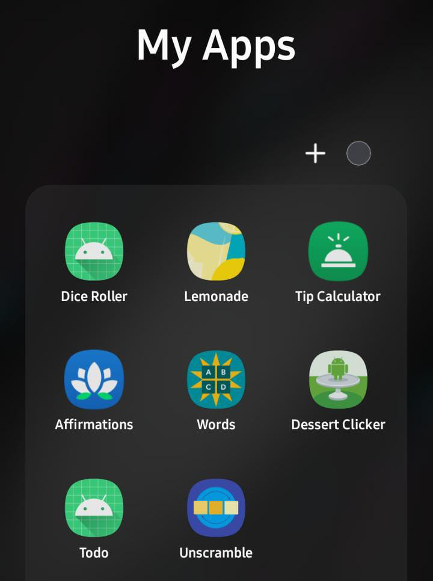

# Android Applications

Collection of simple Android applications developed by me while learning Android Development using Android Studio and Kotlin, as part of the course [Android Basics in Kotlin](https://developer.android.com/courses/android-basics-kotlin/course) by Google.

    

## Projects
* [Lemonade App](./Lemonade-App/README.md)
* [Affirmations App](./Affirmations-App/README.md)
* [Dictionary App](./Dictionary-App/README.md)
* [Dessert Shop App](./Dessert-Shop-App/README.md)
* [Tip Calculator](./Tip-Calculator/README.md)
* [Unscramble App](./Unscramble-App/README.md)