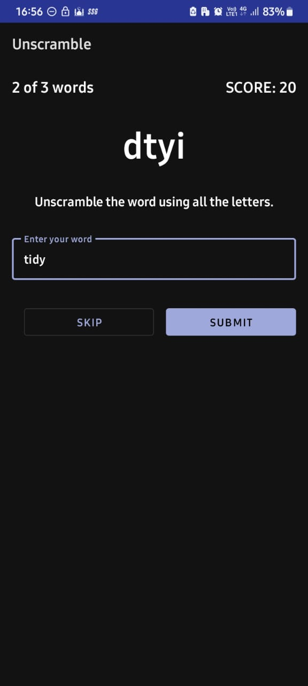

# Unscramble App

Unscramble is  a single player game app that displays scrambled words. To play the game, player has
to make a word using all the letters from the displayed scrambled word.

Used in the [Android Basics with Kotlin](https://developer.android.com/courses/android-basics-kotlin/course) course.

    

